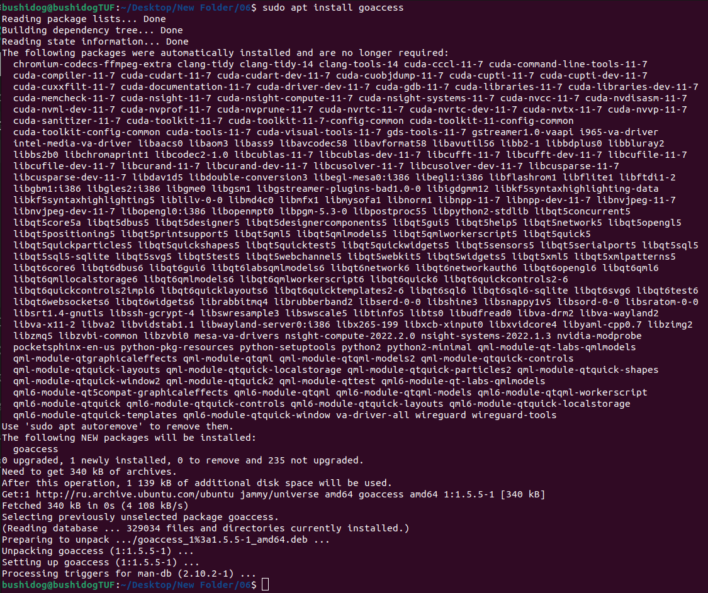
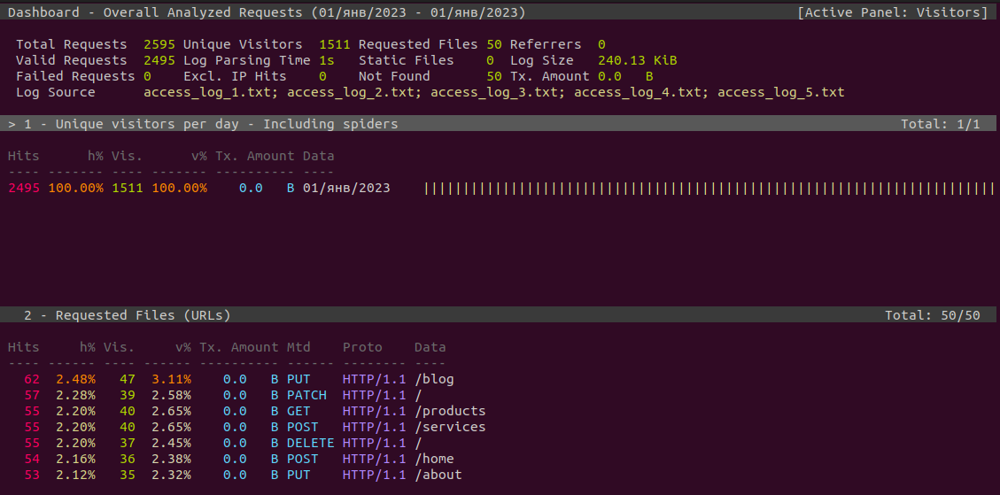
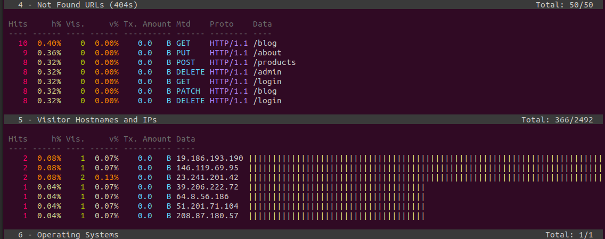
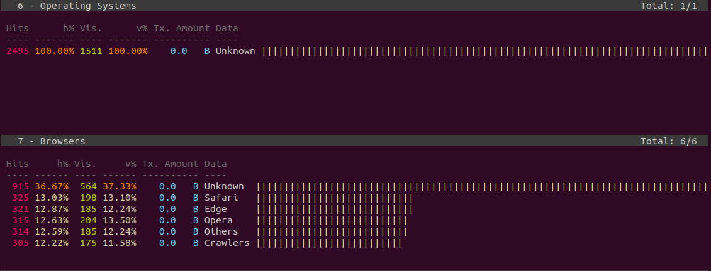

## Part 6. **GoAccess**

Смотреть на результаты трудов в консоли конечно неплохо, но почему бы дополнительно не воспользоваться готовым решением, предоставляющим удобный интерфейс?

**== Задание ==**

С помощью утилиты GoAccess получить ту же информацию, что и в Части 5.

Открыть веб интерфейс утилиты на локальной машине.

---

### 1. Cкачивание и установка

---

### 2. Раскомментируем строки

... в `sudo nano /etc/goaccess/goaccess.conf`

- time-format %H:%M:%S
- date-format %d/%b/%Y
- log-format %h %^[%d:%t %^] "%r" %s %b "%R" "%u" 

---

### 3. Анализ отчетов nginx

### 3. Получить отчет в виде html-страницы

Команда:

    goaccess -a -f ../04/*.txt > report.html
