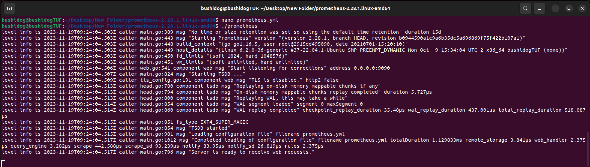
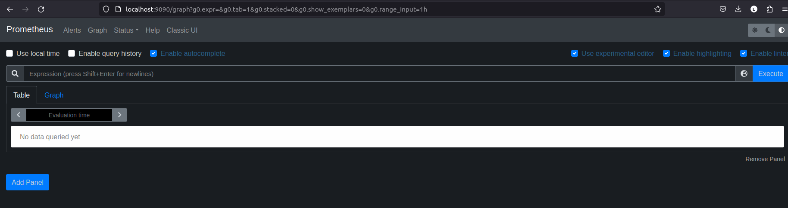
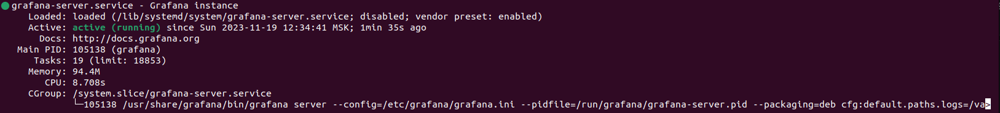
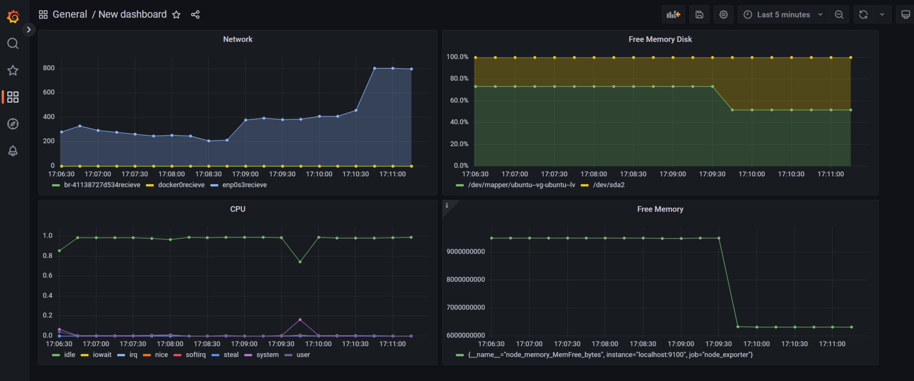
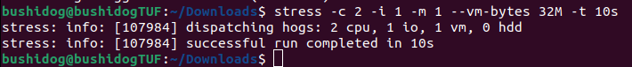
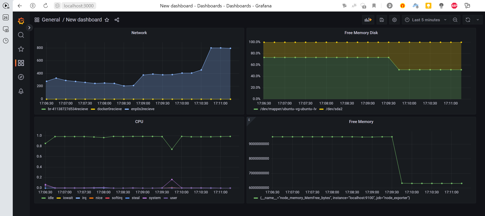

## Установка Prometheus

    Скачаем Prometheus:
    wget https://github.com/prometheus/prometheus/releases/download/v2.28.1/prometheus-2.28.1.linux-amd64.tar.gz
    tar xvf prometheus-2.28.1.linux-amd64.tar.gz

#### Настройка Prometheus

    cd prometheus-2.28.1.linux-amd64
    nano prometheus.yml

    global:
        scrape_interval: 15s
    scrape_configs:
        - job_name: 'prometheus'
        static_configs:
        - targets: ['localhost:9090']

    ./prometheus

## Установка Grafana

    sudo apt-get install -y adduser libfontconfig1 musl
    wget https://dl.grafana.com/enterprise/release/grafana-enterprise_10.2.1_amd64.deb
    sudo dpkg -i grafana-enterprise_10.2.1_amd64.deb

##### Настройка Grafana:

    sudo service grafana-server start

    Откроем веб-интерфейс Grafana в браузере (http://localhost:3000 по умолчанию).
    Учетные данные по умолчанию (admin/admin).

    Добавим источник данных Prometheus:
        1) "Cog" (Settings) в левом меню.
        2) "Data Sources".
        3) "Add your first data source".
        4) "Prometheus".
        5) URL Prometheus (по умолчанию http://localhost:9090).

## Создание и добавление панели в Grafana

    1) Вернитесь на дашборд, нажав на логотип Grafana в левом верхнем углу.
    2) Нажмите на "+" в левом меню и выберите "Dashboard".
    3) Нажмите на "Add new panel".
    4) В разделе "Query" выберите источник данных Prometheus и введите запрос для метрики,  например:
        ЦПУ: node_cpu_seconds_total
        Оперативная память: node_memory_MemAvailable_bytes
        Свободное место на диске: node_filesystem_avail_bytes{mountpoint="/"}
        Количество операций ввода/вывода на диске: node_disk_io_time_seconds_total
    5) Нажмите "Apply" и сохраните панель.

## Создание и добавление панели в Grafana

##### Посмотреть на нагрузку жесткого диска (место на диске и операции чтения/записи)

##### Установить утилиту stress и запустить команду stress -c 2 -i 1 -m 1 --vm-bytes 32M -t 10s

##### Посмотреть на нагрузку жесткого диска, оперативной памяти и ЦПУ

