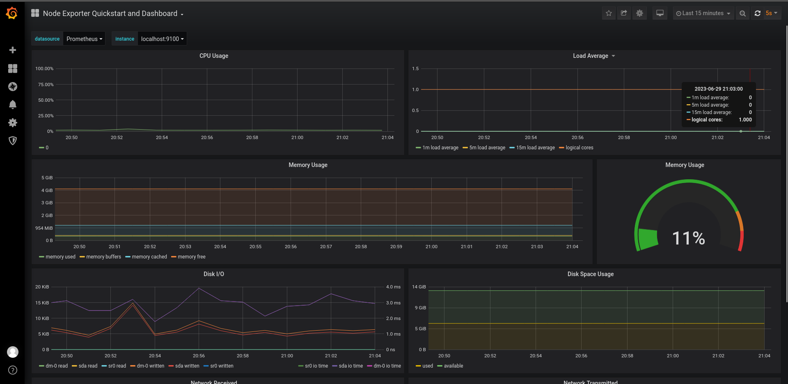
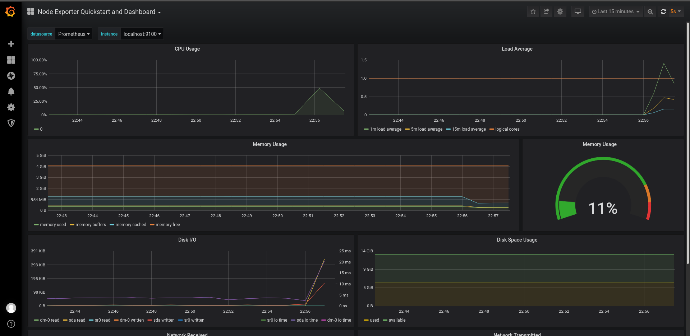
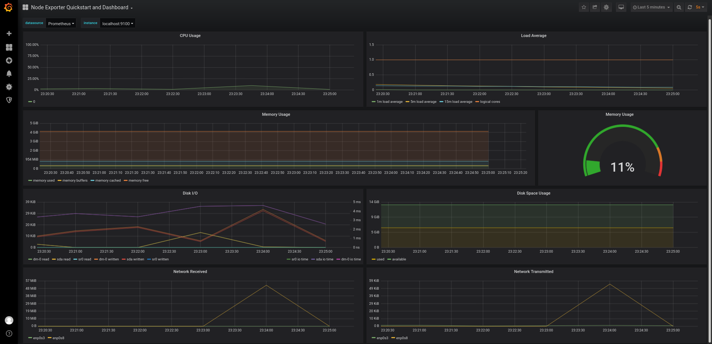

## Part 8. Готовый дашборд

##### 1. Установить готовый дашборд Node Exporter Quickstart and Dashboard с официального сайта Grafana Labs

Готовый дашборд *Node Exporter Quickstart and Dashboard*:

##### 2. Провести те же тесты, что и в [Части 7](#part-7-prometheus-и-grafana)

### Работа с iperf3

##### Запустить ещё одну виртуальную машину, находящуюся в одной сети с текущей
##### Запустить тест нагрузки сети с помощью утилиты **iperf3**

iperf3 ws2:

